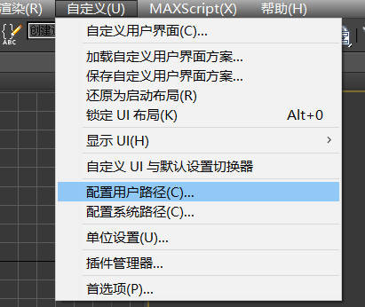

# ForestPack6.22WithLibrary-
下载、安装和使用ForestPack的教程。

A tutorial to download, install and use Forest Pack, a plug-in of 3dmax. It can be used for editions from 3dsmax2014 to 3dsmax2018.

## 1. 素材库下载链接

由于素材库过大，所以上传至阿里云盘，[文件链接](https://www.aliyundrive.com/s/1cjtJGiVtFs)

网盘中包含两个文件夹，其中Library是素材库，另一个文件夹就是这个Repo中的文件夹。

## 2. 插件安装

1. 下载并打开Itoo Software Forest Pack Pro V6.22文件夹

2. 右键以管理员身份运行Install.bat

3. 下一步下一步下一步......中间会弹出一个输入License的框，直接close。如果处于联网状态，最后还会弹出一个Itoo的登录框，也是直接关掉。至此安装完成，下面开始破解

4. 打开 **替换文件** 文件夹，进入对应自己3ds max版本的文件夹，复制里面的.dio文件

5. 进入对应版本的3dsmax的安装目录 `C:|D:|E: /Program Files/Autodesk/3ds Max 20xx/plugins` 用刚刚复制的文件替换掉这里面的同名文件。

6. 打开3dsmax，出现Forest Pack小窗口，点击Fp图标后右侧栏中有Forest Pro说明安装成功

   如果没有出现，在工具栏空白处右键，应该会有一个Forest Pack选项，选中就会出现这个悬浮窗

   

   

## 3. 素材库导入

安装完后点击这里的Select是空的，因为破解软件不会自动关联素材库

首先要下载好Library文件夹，里面应该有四个文件夹：effects、lib、maps、matlib

下面导入素材库：

1. 点击上图中的select，在弹出的窗口中点击Change Preference（在下图中位置）

   

2. 在Library Paths栏下点击右侧Add...

   

3. 定位到 下载好的 /Library/lib目录中，什么都不要选中直接点使用路径

   

​	至此已经导入素材库，下面链接贴图文件夹

4. 在菜单栏中找到 自定义 - 配置用户路径

   

5. 点击外部文件 - 添加。之后定位到 /Library/maps目录中点击使用路径。

   点击确定时可能会出现关于某些路径不可用的提示，直接忽视点击确定即可

   

6. 全部导入完成

